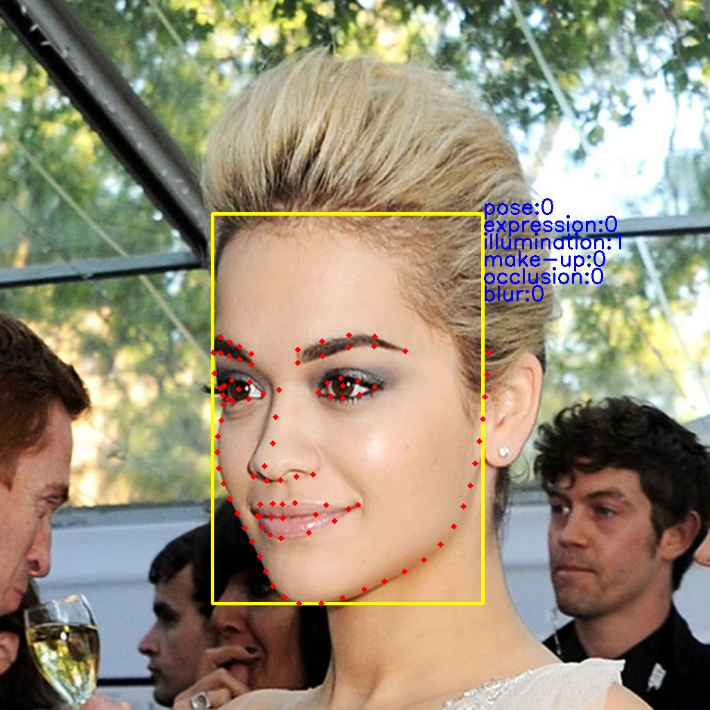
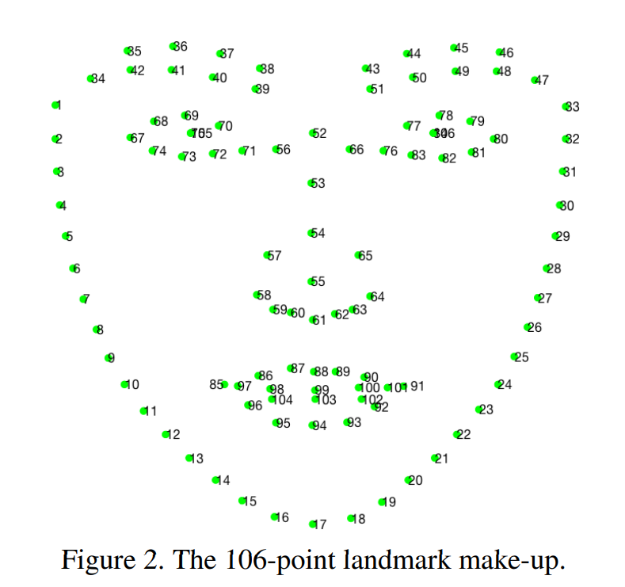
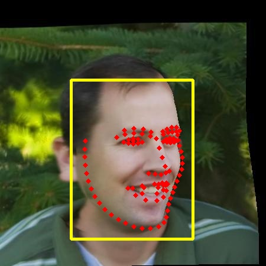
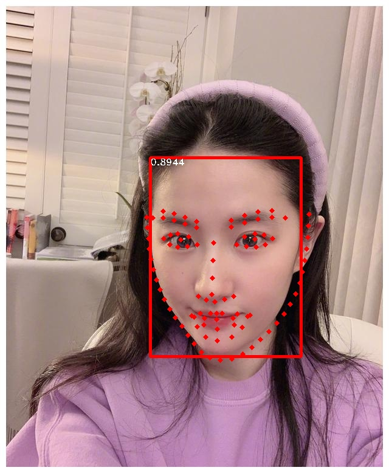
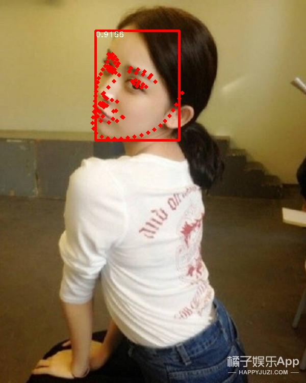
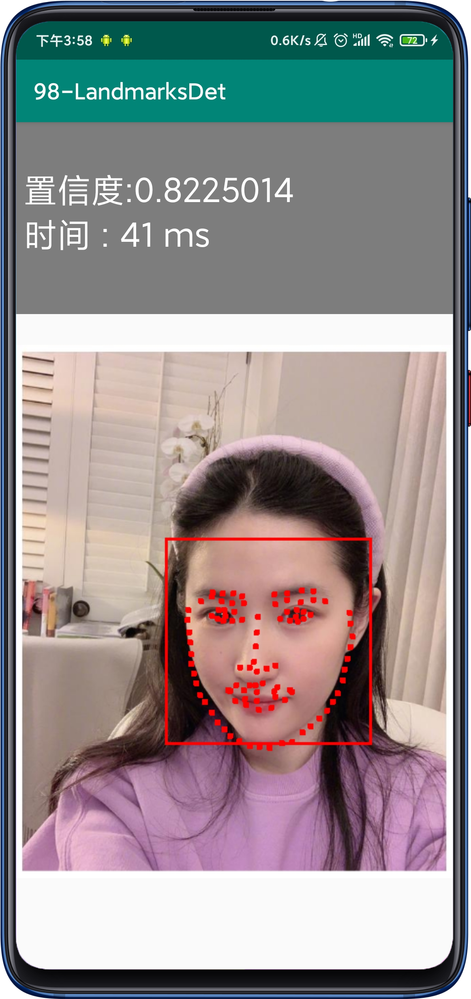
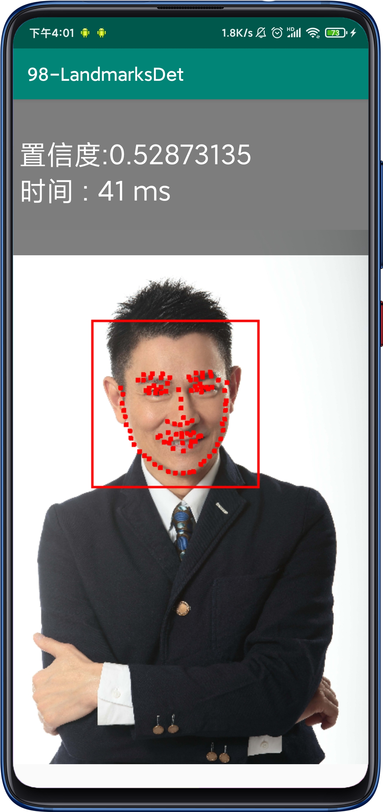
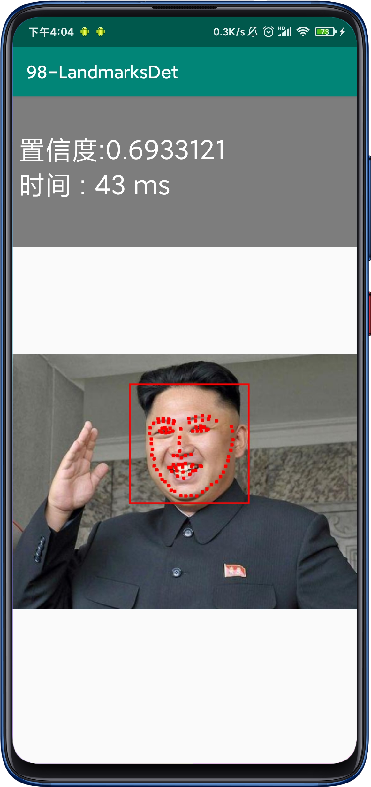

# 98-FaceLandmarks
98 landmark detection

### update
见 https://github.com/midasklr/facelandmarks
更轻量更鲁邦的98点关键点算法，安卓端200fps（855+测试）

## 数据集

### WFLW

使用[98关键点的WFLW数据集](https://wywu.github.io/projects/LAB/WFLW.html).

这是由商汤提供的。里面除了关键点外，还对姿态、表情、照度、化妆、遮挡、模糊等信息进行标注。

数据集包含7,500训练（list_98pt_rect_attr_train.txt），2,500测试（list_98pt_rect_attr_test.txt）。

标签格式如下：

```
coordinates of 98 landmarks (196) + coordinates of upper left corner and lower right corner of detection rectangle (4) + attributes annotations (6) + image name (1)
  x0 y0 ... x97 y97 x_min_rect y_min_rect x_max_rect y_max_rect pose expression illumination make-up occlusion blur image_name
```

每行有196+4+6+1 = 207个。

关键点标注信息如下：


数据集标签标注如下：



### JD-landmark

[106点数据集](https://facial-landmarks-localization-challenge.github.io/#introduction).[论文](https://arxiv.org/pdf/1905.03469.pdf)

需要注意的坑是其中#75和#105重合，#84和#106重合。



数据集样例子：



### 数据集合并

需要注意的是每个图仅仅标注了一张人脸关键点。

合并两个数据集为98关键点数据集。

去除JD-landmark中56/66/57/65/58/64/75/84点。 

合并后数据集链接: https://pan.baidu.com/s/179crM6svNbK3w28Z0ycBHg 提取码: 7guh 

## 算法

使用MobileNetv3作为backbone提取特征，通过PAN和SSH进行特征融合，在三个尺度上（1/8,1/16,/1/32）上进行多尺度预测（考虑到数据集每张图仅仅一个标注人脸，并且都是较大的目标，所以不需要太过浅层的Feature map上预测），同时进行分类和回归box和Landmark。

## Demo

见detect.py

一些效果：



	

## Android

参考之前的[人脸检测](https://github.com/midasklr/facedetection_android.pytorch)






